# Frontend User Interaction Flow

```mermaid
flowchart TD
    TITLE["Frontend User Interaction Flow"]

    subgraph LAND["1) Landing (/ )"]
        L1["App load + auth init"]
        L2["Landing page: load tenders"]
        L3{"Tenders loaded?"}
        L4["Show loading state"]
        L5["Empty state + Create your first tender"]
        L6["Populated tender cards"]
        L7["Search tenders (filter list)"]
        L8["Open tender card"]
        L9["Click + Create New Tender"]
        L10["Click delete tender"]
        L11{"Confirm delete?"}
        L12["Delete success: remove card"]
        L13["Delete failed: error dialog"]
    end

    subgraph CREATE["2) Create New Tender Modal"]
        C1["Open Create New Tender modal"]
        C2["Config loading"]
        C3{"Config valid?"}
        C4["Show config error in modal"]
        C5["Browse SharePoint Path (folder picker)"]
        C6["SharePoint path selected + identifiers set"]
        C7["Auto-fill tender name from folder"]
        C8["Browse Output Location (folder picker)"]
        C9["Output location selected + identifiers set"]
        C10["Manual tender name edit (optional)"]
        C11["Click Create Tender"]
        C12{"All required fields present?"}
        C13["Show validation error"]
        C14["Tender created successfully"]
        C15["Close modal + navigate to /tender/:tenderId"]
    end

    subgraph FILES["3) Tender Management - Files Tab"]
        F1["Tender page load: config + tender + files"]
        F2["Files list loaded (exclude_batched=true)"]
        F3["Local upload entry: drag/drop or select files"]
        F4{"File count <= 20?"}
        F5["Concurrent frontend upload path"]
        F6["Bulk upload job path"]
        F7["Upload status: uploading"]
        F8["Upload status: paused"]
        F9["Upload status: cancelling"]
        F10["Upload status: complete"]
        F11["Outcome: all uploaded"]
        F12["Outcome: partial failed"]
        F13["Outcome: cancelled"]
        F14["Upload panel actions: Pause / Resume / Cancel / Dismiss"]
        F15["Reload files after upload complete"]
        F16["File browser: select / multiselect"]
        F17["File preview panel updates"]
        F18["Single delete confirm"]
        F19["Single delete result + reload files"]
        F20["Bulk delete confirm"]
        F21["Bulk delete result (+ partial-failure alert if needed)"]
        F22["Queue Extraction button clicked"]
        F23{"Selected files > 0?"}
        F24["Alert: No Files Selected"]
    end

    subgraph SP["4) SharePoint Import Path"]
        S1["Click Browse SharePoint"]
        S2["Scanning SharePoint folders"]
        S3{"Files found to import?"}
        S4["Start import job"]
        S5["Import progress polling (running)"]
        S6["Completed"]
        S7["Completed with errors"]
        S8["Failed"]
        S9["Lost connection to import job"]
        S10["Refresh files list"]
        S11["Show import error/warning panel"]
    end

    subgraph EX["5) Queue Extraction Modal"]
        E1["Open Queue Extraction modal"]
        E2["Load destination folders"]
        E3{"Destination folders available?"}
        E4["Destination selected"]
        E5["No destination folders available"]
        E6["Toggle Requires Title Block (optional)"]
        E7["Page-size check: checking"]
        E8["Page-size warning shown"]
        E9["Page-size check passed"]
        E10["Open region selector modal"]
        E11["Load PDF preview"]
        E12["Draw region"]
        E13["Reset region (optional)"]
        E14["Confirm region selection"]
        E15["Submit extraction"]
        E16{"Destination selected?"}
        E17["Validation error: select destination"]
        E18{"Requires title block and region set?"}
        E19["Validation error: define title block region"]
        E20["Batch queued successfully"]
        E21["Modal closes"]
        E22["Clear selected files + clear preview"]
        E23["Switch active tab to Batches"]
        E24["Show success alert"]
    end

    subgraph BATCH["6) Batches Tab + Batch Viewer"]
        B1["Batches tab"]
        B2["Batch list loading"]
        B3{"Batches exist?"}
        B4["Empty state: no batches submitted yet"]
        B5["Batch cards shown (pending/submitting/running/completed/failed)"]
        B6["Running batches: progress summary polling"]
        B7["Open batch detail viewer"]
        B8["File-level status table (queued/extracted/exported/failed)"]
        B9{"Batch status is failed?"}
        B10["Retry submission confirmation"]
        B11["Retry request sent; viewer closes to list"]
        B12["Delete batch confirmation"]
        B13["Batch deleted; files become uncategorized (visible after reload)"]
        B14["Back to batch list + refresh"]
    end

    TITLE --> L1
    L1 --> L2
    L2 --> L4 --> L3
    L3 -->|"No tenders"| L5
    L3 -->|"Has tenders"| L6
    L5 --> L9
    L6 --> L7 --> L6
    L6 --> L8 --> F1
    L6 --> L10 --> L11
    L11 -->|"Cancel"| L6
    L11 -->|"Confirm"| L12 --> L6
    L12 -. "may become empty" .-> L5
    L11 -->|"Confirm + API error"| L13 --> L6
    L9 --> C1

    C1 --> C2 --> C3
    C3 -->|"No"| C4
    C3 -->|"Yes"| C5
    C5 --> C6 --> C7 --> C10
    C5 --> C8 --> C9
    C9 --> C10
    C10 --> C11 --> C12
    C12 -->|"Missing required fields"| C13 --> C11
    C12 -->|"Valid"| C14 --> C15 --> F1
    C4 --> C1

    F1 --> F2
    F2 --> F16 --> F17
    F16 --> F18 --> F19 --> F2
    F16 --> F20 --> F21 --> F2
    F2 --> F3 --> F4
    F4 -->|"Yes (<=20)"| F5 --> F7
    F4 -->|"No (>20)"| F6 --> F7
    F7 --> F14
    F14 -->|"Pause"| F8 -->|"Resume"| F7
    F14 -->|"Cancel"| F9 --> F10
    F7 --> F10
    F10 --> F11 --> F15 --> F2
    F10 --> F12 --> F15
    F10 --> F13 --> F15
    F10 -->|"Dismiss"| F2
    F2 --> F22 --> F23
    F23 -->|"No"| F24 --> F2
    F23 -->|"Yes"| E1

    F2 --> S1 --> S2 --> S3
    S3 -->|"No"| S11 --> F2
    S3 -->|"Yes"| S4 --> S5
    S5 --> S6 --> S10 --> F2
    S5 --> S7 --> S11 --> S10
    S5 --> S8 --> S11
    S5 --> S9 --> S11

    E1 --> E2 --> E3
    E3 -->|"No"| E5
    E3 -->|"Yes"| E4 --> E6
    E6 -->|"Off"| E15
    E6 -->|"On"| E7
    E7 --> E8
    E7 --> E9
    E8 --> E10
    E9 --> E10
    E10 --> E11 --> E12
    E12 --> E13 --> E12
    E12 --> E14 --> E15
    E15 --> E16
    E16 -->|"No"| E17 --> E15
    E16 -->|"Yes"| E18
    E18 -->|"No (required but missing)"| E19 --> E15
    E18 -->|"Yes"| E20 --> E21 --> E22 --> E23 --> B1
    E23 --> E24
    E5 --> E15

    B1 --> B2 --> B3
    B3 -->|"No"| B4
    B3 -->|"Yes"| B5
    B5 --> B6 --> B5
    B5 --> B7 --> B8 --> B9
    B9 -->|"Yes"| B10 --> B11 --> B14 --> B5
    B9 -->|"No"| B12
    B12 -->|"Confirm delete"| B13 --> B14 --> B5
    B12 -->|"Cancel"| B8
    B7 -->|"Back"| B14

    classDef action fill:#e6f4ff,stroke:#1677ff,color:#002766;
    classDef decision fill:#fff7e6,stroke:#d46b08,color:#613400;
    classDef polling fill:#f6ffed,stroke:#389e0d,stroke-dasharray: 5 3,color:#135200;
    classDef terminal fill:#fff1f0,stroke:#cf1322,color:#820014;

    class L1,L2,L4,L5,L6,L7,L8,L9,L10,L12,L13 action;
    class C1,C2,C4,C5,C6,C7,C8,C9,C10,C11,C13,C14,C15 action;
    class F1,F2,F3,F5,F6,F7,F8,F9,F10,F14,F15,F16,F17,F18,F19,F20,F21,F22,F24 action;
    class S1,S2,S4,S10,S11 action;
    class E1,E2,E4,E5,E6,E7,E8,E9,E10,E11,E12,E13,E14,E15,E17,E19,E20,E21,E22,E23,E24 action;
    class B1,B2,B4,B5,B7,B8,B10,B11,B12,B13,B14 action;

    class L3,L11,C3,C12,F4,F23,S3,E3,E16,E18,B3,B9 decision;
    class S5,B6 polling;
    class S6,S7,S8,S9,F11,F12,F13 terminal;
```

## Legend

- Blue rectangles: user-visible UI actions and states.
- Orange diamonds: validation or decision branches.
- Green dashed nodes: background polling/progress updates.
- Red nodes: terminal outcomes (success/partial/failure/cancelled paths).
